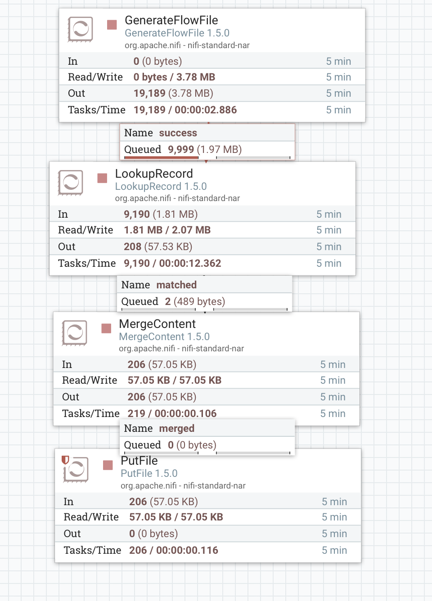
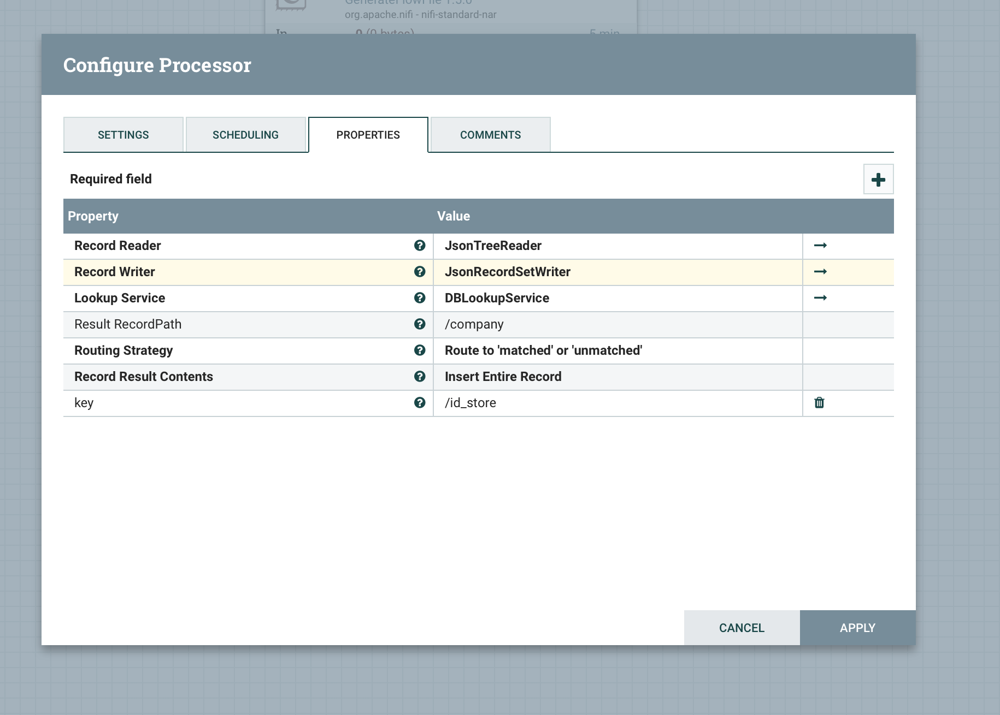
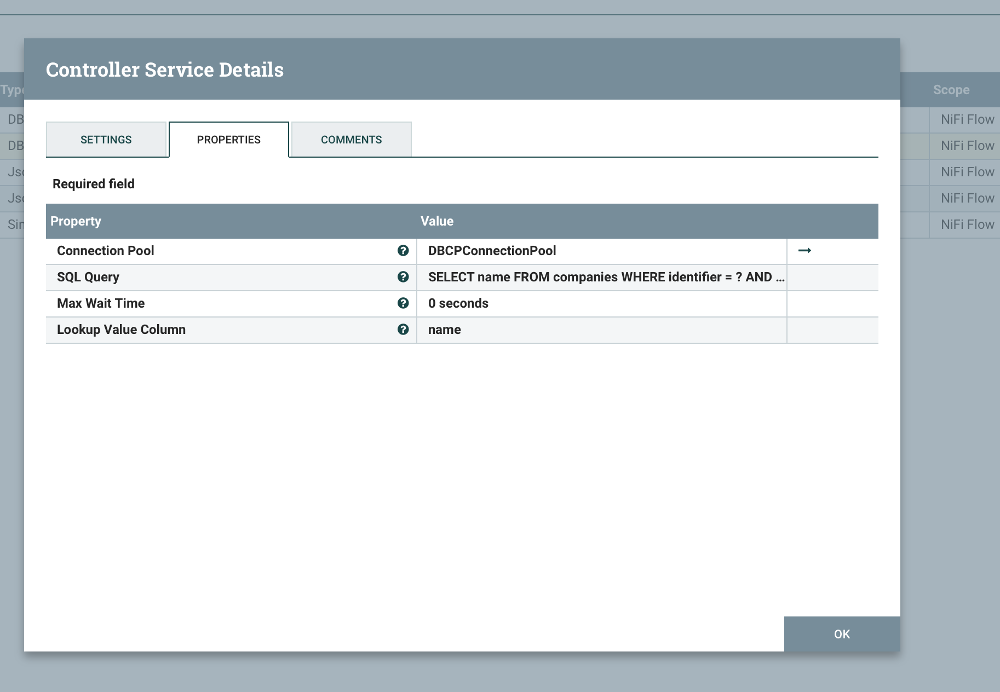

# Apache NiFi SQL Lookup Service

## Usage

* [Download Apache NIFI](https://nifi.apache.org/download.html)

* Compile and install `nifi-sqllookup-bundle`

```bash
> cd nifi-sqllookup-bundle
> mvn package
> cp ./nifi-sqllookup-services-nar/target/nifi-sqllookup-services-nar-1.5.0.nar /NIFI_INSTALL/lib/
> cp ./nifi-sqllookup-services-nar/target/nifi-sqllookup-services-api-nar-1.5.0.nar /NIFI_INSTALL/lib/
```







